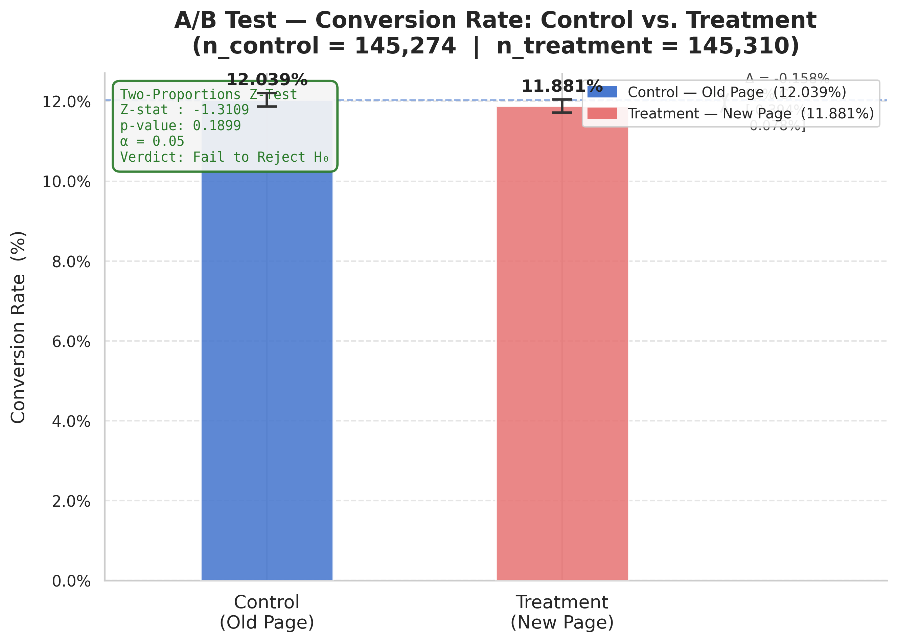
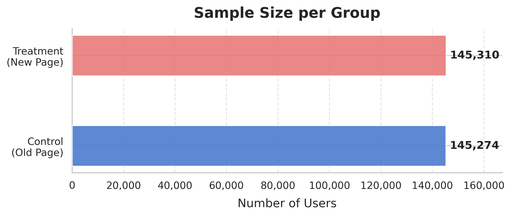
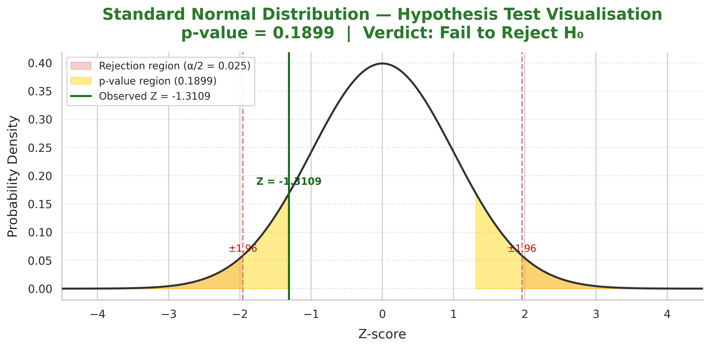

# 📊 E-commerce Conversion Rate Optimisation — A/B Test Analysis

> *Does a new landing page truly convert better — or are we fooled by randomness?*
> A rigorous, end-to-end A/B test analysis using statistical hypothesis testing, confidence intervals, and publication-quality visualisations.

[](https://www.python.org/)
[](https://pandas.pydata.org/)
[](https://www.statsmodels.org/)
[](https://scipy.org/)
[](LICENSE)

---

## 📁 Project Structure

```
ab_testing_project/
│
├── data/
│   └── raw/
│       └── ab_data.csv            ← Raw A/B test dataset
│
├── src/
│   ├── __init__.py
│   ├── data_prep.py               ← Data loading & cleaning module
│   ├── stats_analysis.py          ← Z-Test & confidence interval module
│   └── visualizations.py          ← Chart generation module
│
├── results/
│   ├── conversion_rates_comparison.png
│   ├── sample_sizes.png
│   └── z_distribution.png
│
├── main.py                        ← Pipeline entry point
├── requirements.txt
└── README.md
```

---

## 🧩 Business Problem

An e-commerce company has designed a **new landing page** and wants to know whether it converts more visitors into customers than the existing (old) page.

To answer this question rigorously — rather than relying on intuition — the engineering team ran a **randomised controlled A/B experiment**:

| Group | Experience | Goal |
|---|---|---|
| **Control** | Old landing page | Establish baseline conversion rate |
| **Treatment** | New landing page | Measure incremental lift |

Users were randomly assigned to one group. The primary outcome metric is the **conversion rate** — the proportion of users who complete a purchase after landing on the page.

**The core question:** Is any observed difference in conversion rates between the two groups a genuine effect of the page design, or is it simply due to **random chance**?

---

## 🔬 Methodology

### Dataset

| Column | Type | Description |
|---|---|---|
| `user_id` | int | Unique visitor identifier |
| `timestamp` | str | UTC datetime of the page view |
| `group` | str | `control` or `treatment` |
| `landing_page` | str | `old_page` or `new_page` |
| `converted` | int | `1` = converted, `0` = did not convert |

**Raw dataset:** 294,478 rows × 5 columns

### Data Cleaning (`src/data_prep.py`)

Two cleaning rules are applied **before** any statistics are computed:

**Rule 1 — Group/Page Alignment Filter**

In production A/B test pipelines, tracking systems occasionally log a user under the wrong group (e.g. a control user who accidentally saw the new page, or vice versa). Keeping these rows would contaminate both baselines. We enforce the strict invariant:

```
control   → old_page   ✅  keep
treatment → new_page   ✅  keep
control   → new_page   ❌  remove (3,893 rows)
treatment → old_page   ❌  remove (included above)
```

**Rule 2 — Duplicate User ID Removal**

A user appearing multiple times (session replays, logging bugs) would inflate *N* and distort conversion rates. Only the first occurrence of each `user_id` is retained (1 duplicate removed).

**Final clean dataset:** 290,584 rows — 145,274 control / 145,310 treatment

---

### Why a Two-Proportions Z-Test?

The outcome variable `converted` is **binary** (Bernoulli-distributed: 0 or 1). We are comparing the *proportion* of successes between two independent groups. The correct test for this estimand is the **Two-Proportions Z-Test** because:

1. **Large samples** — both groups have N > 100,000, satisfying the Central Limit Theorem conditions for the normal approximation to hold with excellent accuracy.
2. **Independence** — users were randomly assigned; observations within and between groups are independent.
3. **Binary outcome** — the Z-test for proportions is the direct, well-established method for this data type.
4. **Two-sided test** — we are agnostic about the direction of the effect; we want to detect both improvements *and* regressions.

**Hypotheses:**

```
H₀ : p_treatment − p_control  = 0   (no difference)
H₁ : p_treatment − p_control ≠ 0   (two-sided, α = 0.05)
```

---

## 📈 Results

### Visualisations

#### Conversion Rate Comparison (with 95% CIs)


#### Group Sample Sizes


#### Z-Distribution — Hypothesis Test


---

## 🎯 Executive Summary

*Written for a non-technical audience — no statistics degree required.*

- **We tested two versions of our landing page** on ~290,000 real users, split roughly 50/50 between the old design (control) and the new design (treatment).

- **The new page performed slightly worse**, not better: the control group converted at **12.04%** while the treatment group converted at **11.88%** — a difference of **−0.16 percentage points**.

- **This difference is not statistically meaningful.** Our p-value of **0.1899** is well above the industry-standard threshold of 0.05. In plain English: a difference this small would occur by random chance roughly **19% of the time**, even if the two pages were identical.

- **The 95% confidence interval** for the true difference in conversion rates is **[−0.39%, +0.08%]**. Because this range includes zero, we *cannot* rule out the possibility that the two pages perform identically.

- **Statistical verdict:** ❌ **Fail to Reject the Null Hypothesis.**

- **Business recommendation:** 🚫 **Do NOT roll out the new page.** The data does not support the claim that the new design improves conversions. The product team should investigate UX improvements, run targeted user research, or test bolder design changes before re-running the experiment.

---

## 🛠 Installation & Usage

### 1. Clone the repository

```bash
git clone https://github.com/your-username/ab-test-ecommerce-cro.git
cd ab-test-ecommerce-cro
```

### 2. Create and activate a virtual environment (recommended)

```bash
python -m venv venv
source venv/bin/activate          # macOS / Linux
venv\Scripts\activate             # Windows
```

### 3. Install dependencies

```bash
pip install -r requirements.txt
```

### 4. Add the dataset

Place `ab_data.csv` into `data/raw/`:

```bash
cp /path/to/ab_data.csv data/raw/
```

### 5. Run the full pipeline

```bash
python main.py
```

Optional arguments:

```bash
python main.py --data data/raw/ab_data.csv --results results/ --alpha 0.05
```

---

### 📟 Example Terminal Output

```
2026-05-12 11:58:24  INFO   main — ━━━  A/B Test Analysis pipeline starting  ━━━
2026-05-12 11:58:24  INFO   main — [1/4] Loading raw data…
2026-05-12 11:58:25  INFO   src.data_prep — Raw data loaded successfully — shape: (294478, 5)
2026-05-12 11:58:25  INFO   main — [2/4] Cleaning data…
2026-05-12 11:58:25  INFO   src.data_prep — Alignment filter: removed 3893 misaligned rows.
2026-05-12 11:58:25  INFO   src.data_prep — Duplicate removal: removed 1 duplicate user_id records.
2026-05-12 11:58:25  INFO   src.data_prep — Cleaning complete — 294478 → 290584 rows
2026-05-12 11:58:25  INFO   main — [3/4] Running statistical analysis…
2026-05-12 11:58:25  INFO   src.stats_analysis — Z-stat: -1.3109 | p-value: 0.1899
2026-05-12 11:58:25  INFO   src.stats_analysis — 95% CI for rate difference: [-0.00394, 0.00078]
2026-05-12 11:58:25  INFO   main — [4/4] Generating visualisations…

══════════════════════════════════════════════════════════════════════
               E-COMMERCE CRO A/B TEST — EXECUTIVE REPORT
══════════════════════════════════════════════════════════════════════

──  EXPERIMENT OVERVIEW  ───────────────────────────────────────────
  Hypothesis (H₀):          p_treatment = p_control  (no difference)
  Hypothesis (H₁):          p_treatment ≠ p_control  (two-sided)
  Test type:                Two-Proportions Z-Test
  Significance level:       α = 0.05  (95% confidence)

──  SAMPLE STATISTICS  ─────────────────────────────────────────────
  Control group  — sample size:       145,274
  Treatment group — sample size:      145,310
  Total users analysed:               290,584
  Pooled conversion probability:   0.119597  (11.9597%)

──  CONVERSION RATES  ──────────────────────────────────────────────
  Control   (Old Page)  conversion rate:  12.0386%
  Treatment (New Page)  conversion rate:  11.8808%
  Observed lift  (Δ = treatment − control): -0.1578%
  Relative lift:                           -1.31%

──  STATISTICAL RESULTS  ───────────────────────────────────────────
  Z-statistic:                    -1.3109
  p-value (two-sided):             0.1899
  95% CI for Δ (lower):          -0.3938%
  95% CI for Δ (upper):          +0.0781%

──────────────────────────────────────────────────────────────────
  STATISTICAL VERDICT:  ❌  FAIL TO REJECT the Null Hypothesis
──────────────────────────────────────────────────────────────────

  📌 RECOMMENDATION: Do NOT roll out the new page at this time.
     The current evidence does not support the hypothesis that
     the new design improves conversion.

══════════════════════════════════════════════════════════════════════

2026-05-12 11:58:26  INFO   main — Pipeline complete in 1.83 seconds.
```

---

## 📦 Dependencies

| Library | Version | Purpose |
|---|---|---|
| `pandas` | ≥ 2.0 | Data loading, manipulation, grouping |
| `numpy` | ≥ 1.24 | Numerical operations, array math |
| `scipy` | ≥ 1.11 | Normal distribution (z-critical values) |
| `statsmodels` | ≥ 0.14 | Two-Proportions Z-Test, proportion CIs |
| `matplotlib` | ≥ 3.7 | Chart rendering & saving |
| `seaborn` | ≥ 0.12 | Theme and style management |
| `colorama` | ≥ 0.4 | Coloured terminal output (optional) |

---


